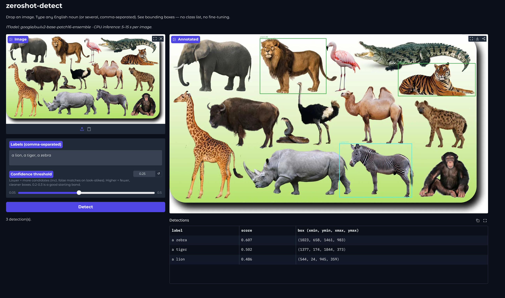

# zeroshot-detect

[](https://github.com/Joncik91/zeroshot-detect/actions/workflows/ci.yml)
[](https://huggingface.co/spaces/Joncik/zeroshot-detect)
[](https://www.python.org/)
[](LICENSE)
[](https://huggingface.co/google/owlv2-base-patch16-ensemble)
[](https://mypy.readthedocs.io/en/stable/)
[](docs/adr/)
[](CONTRIBUTING.md)

**Drop in any image. Type any English noun. Get bounding boxes — no class list, no fine-tuning.**

> 👉 **[Try the live demo](https://huggingface.co/spaces/Joncik/zeroshot-detect)** — drop a photo, type "a hat, a dog, a coffee cup", see the boxes drawn instantly.



## Table of Contents

- [What It Does](#what-it-does)
- [How It Works](#how-it-works)
- [Architectural Decisions](#architectural-decisions)
- [Running Locally](#running-locally)
- [Engineering Rules](#engineering-rules)
- [Security](#security)
- [License](#license)

## What It Does

Pretrained zero-shot object detection over **[OWLv2](https://huggingface.co/google/owlv2-base-patch16-ensemble)** (Apache-2.0, 200M parameters). The model jointly embeds image patches and your text queries, scores patch-text similarity, and returns one bounding box per accepted match. No fine-tuning, no closed class set — type what you want and the model looks for it.

## How It Works

1. **Load** — OWLv2-base loaded once via `transformers`, lazily on first inference.
2. **Embed** — your image and your comma-separated labels (`"a hat, a dog, a coffee cup"`) go through the model's vision and text encoders in a single forward pass.
3. **Score** — every image patch gets a similarity score against every text query. Boxes above the confidence threshold survive.
4. **Render** — server-side `PIL.ImageDraw` overlay (boxes + label + score) — the screenshot a visitor takes IS the demo output.

## Architectural Decisions

- [ADR-0001 — Scope and model choice](docs/adr/0001-scope-and-model-choice.md)
- [ADR-0002 — Detection data contract](docs/adr/0002-detection-data-contract.md)
- [ADR-0003 — Rendering strategy](docs/adr/0003-rendering-strategy.md)
- [ADR-0004 — UI and deployment](docs/adr/0004-ui-and-deployment.md)
- [ADR-0005 — Non-max suppression](docs/adr/0005-non-max-suppression.md)

## Running Locally

```bash
git clone https://github.com/Joncik91/zeroshot-detect.git
cd zeroshot-detect
python -m venv .venv && source .venv/bin/activate
pip install -e ".[dev,detect,app]"
python app.py
```

First request triggers a one-time ~800 MB OWLv2 download from the Hugging Face Hub. Subsequent requests are fast.

Full guide: [`docs/running-locally.md`](docs/running-locally.md). Deploy: [`docs/deploying.md`](docs/deploying.md).

## Engineering Rules

Hard rules codified in [`CONTRIBUTING.md`](CONTRIBUTING.md):

- **DRY** on the second occurrence — no copy-paste tolerated.
- **Code comments** explain WHAT and WHY, never HOW. The code is the HOW.
- **Commit messages** are WHAT changed, WHY it changed, WHERE it landed. One logical change per commit.
- **Documentation lands in the same commit as the code it describes.**

## Security

The image and labels you submit are processed **entirely on the host
running the app** — there is no remote inference call. Two consequences:

1. **Inputs never leave the machine after the model is loaded.** The
   live HF Space demo runs in Hugging Face's compute, but a local
   `python app.py` keeps everything local.
2. **The model weights are downloaded once from the HF Hub** (~800 MB
   OWLv2 ensemble checkpoint) on first inference. Read-only fetch;
   nothing of yours is uploaded.

Useful default for sensitive imagery: clone, install, run `python app.py`
locally, and make sure outbound traffic from the venv is firewalled
after the initial weights pull. The detector keeps no logs, no cache
of inputs.

## License

MIT — see [LICENSE](LICENSE). The OWLv2 model weights ship under
Apache-2.0; using them from this MIT-licensed wrapper is fine because
the model's licence governs the model artefact, not the surrounding code.
